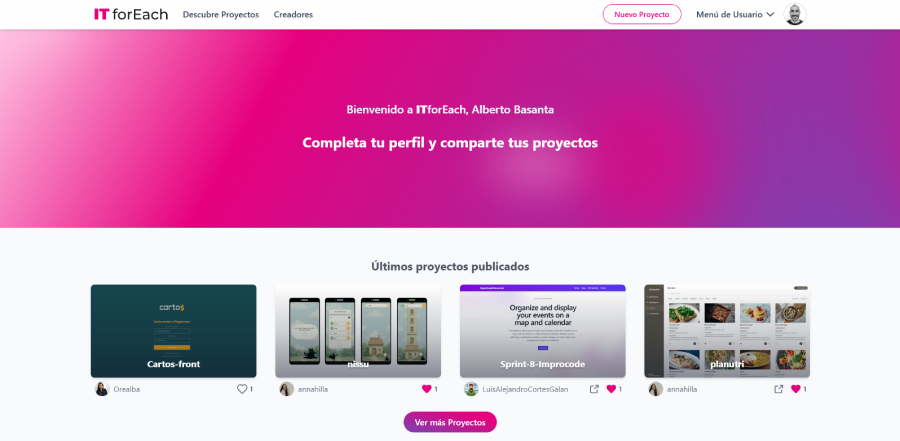

# ITforEach

<p align="center">
  
</p>


## 📄 Descripción

**ITforEach** es una plataforma donde desarrolladores comparten sus proyectos, descubren el trabajo de otros y se conectan con la comunidad. Permite publicar proyectos personales sincronizados con GitHub, ver el perfil de otros usuarios y explorar nuevos desarrollos.

---

🎥 **Presentación del proyecto:**  
Descubre todas las funcionalidades, diseño y decisiones técnicas en esta presentación completa:  
👉 [Ver presentación ITforEach](https://gamma.app/docs/Descubre-y-comparte-tus-proyectos-7dxf0kf8e2u6lqs?mode=doc)

💭 **Introducción personal (antes de presentar):**  
Un enfoque simpático y reflexivo para romper el hielo y explicar cómo surgió la idea del proyecto:  
👉 [Ver introducción - ¿Qué pensáis al ver las presentaciones de proyectos?](https://gamma.app/docs/Que-pensais-al-ver-las-presentaciones-de-proyectos-finales-hscscy0gopbh38c?mode=doc)


## ✨ Características

- **Autenticación con GitHub**: Accede de forma rápida y segura usando tu cuenta de GitHub.
- **Explora proyectos de la comunidad**: Visualiza los proyectos publicados por otros desarrolladores.
- **Publicación automática desde GitHub**: Al publicar un proyecto puedes indicar un repositorio y se importan automáticamente el nombre, descripción, enlace al repositorio y website si existe.
- **Gestión de perfil**: Cada usuario tiene su propia página con sus proyectos, enlaces y biografía.
- **Base de datos gestionada por Supabase**: Usuarios y proyectos almacenados en una base de datos relacional conectada en tiempo real.
- **Almacenamiento de imágenes en Cloudinary**: Para una carga rápida y eficiente de imágenes de los proyectos.
- **Diseño moderno y responsive con Tailwind CSS**.
- **Despliegue en Vercel**: Disponible online en [https://itforeach.vercel.app](https://itforeach.vercel.app)

## 💻 Tecnologías Utilizadas

- **Angular CLI** versión 19.
- **Tailwind CSS** para el diseño y maquetación.
- **Supabase** para autenticación, almacenamiento y base de datos.
- **Cloudinary** para la gestión de imágenes.
- **Vercel** como plataforma de despliegue.

## 📋 Requisitos

- **Node.js** y **npm** instalados en tu sistema. Descárgalos desde [nodejs.org](https://nodejs.org/).

## 🛠️ Instalación

### **✔️ Instalación paso a paso**

**1️⃣ Clona este repositorio:**
```bash
git clone https://github.com/basantades/ITforEach.git
```

**2️⃣ Ingresa al directorio del proyecto:**
```bash
cd ITforEach
```

**3️⃣ Instala las dependencias:**
```bash
npm install
```

## ⚙️ Configuración del entorno

Antes de ejecutar la aplicación, es necesario configurar el archivo de entorno con tus propias claves.

**1️⃣ Renombra el archivo de ejemplo:**

```bash
mv src/environments/environment.example.ts src/environments/environment.ts
```

**2️⃣ Edita el archivo environment.ts y completa los valores con tus datos:**
```ts
// src/environments/environment.ts
export const environment = {
  production: false,
  supabaseUrl: 'TU_URL_SUPABASE',
  supabaseAnonKey: 'TU_CLAVE_ANON_SUPABASE',
  redirectUrl: 'URL_DE_REDIRECCIÓN_TRAS LOGIN',
  cloudinaryUploadUrl: 'TU_URL_CLOUDINARY_UPLOAD'
};
```

## ▶️ Ejecución

Para iniciar la aplicación en desarrollo:
```bash
ng serve
```

Abre tu navegador y accede a `http://localhost:4200/`.

## 🤝 Contribuciones

Este proyecto no está abierto a contribuciones externas por el momento.

---

Este README proporciona una guía básica para configurar y utilizar el proyecto **ITforEach**.
